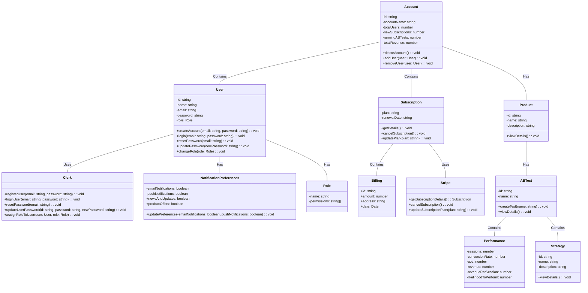

```mermaid
classDiagram

    class User {
        -id: string
        -name: string
        -email: string
        -password: string
        -role: Role
        +createAccount(email: string, password: string): void
        +login(email: string, password: string): void
        +resetPassword(email: string): void
        +updatePassword(newPassword: string): void
        +changeRole(role: Role): void
    }

    class Role {
        -name: string
        -permissions: string[]
    }

    class Account {
        -id: string
        -accountName: string
        -totalUsers: number
        -newSubscriptions: number
        -runningABTests: number
        -totalRevenue: number
        +deleteAccount(): void
        +addUser(user: User): void
        +removeUser(user: User): void
    }

    class NotificationPreferences {
        -emailNotifications: boolean
        -pushNotifications: boolean
        +newsAndUpdates: boolean
        +productOffers: boolean
        +updatePreferences(emailNotifications: boolean, pushNotifications: boolean): void
    }

    class Subscription {
        -plan: string
        -renewalDate: string
        +getDetails(): void
        +cancelSubscription(): void
        +updatePlan(plan: string): void
    }

    class Billing {
        +id: string
        +amount: number
        +address: string
        +date: Date
    }

    class ABTest {
        -id: string
        -name: string
        +createTest(name: string): void
        +viewDetails(): void
    }

    class Performance {
        -sessions: number
        -conversionRate: number
        -aov: number
        -revenue: number
        -revenuePerSession: number
        -likelihoodToPerform: number
    }

    class Strategy {
        -id: string
        -name: string
        -description: string
        +viewDetails(): void
    }

    class Product {
        -id: string
        -name: string
        -description: string
        +viewDetails(): void
    }

    class Clerk {
        +registerUser(email: string, password: string): void
        +loginUser(email: string, password: string): void
        +resetPassword(email: string): void
        +updateUserPassword(id: string, password: string, newPassword: string): void
        +assignRoleToUser(user: User, role: Role): void
    }

    class Stripe {
        +getSubscriptionDetails(): Subscription
        +cancelSubscription(): void
        +updateSubscriptionPlan(plan: string): void
    }

    User -- Clerk : Uses
    User -- NotificationPreferences : Has
    User -- Role : Has
    Account -- User : Contains
    Account -- Subscription : Contains
    Account -- Product: Has
    Subscription -- Billing : Contains
    Subscription -- Stripe : Uses
    Product -- ABTest : Has
    ABTest -- Performance : Contains
    ABTest -- Strategy : Contains
```
