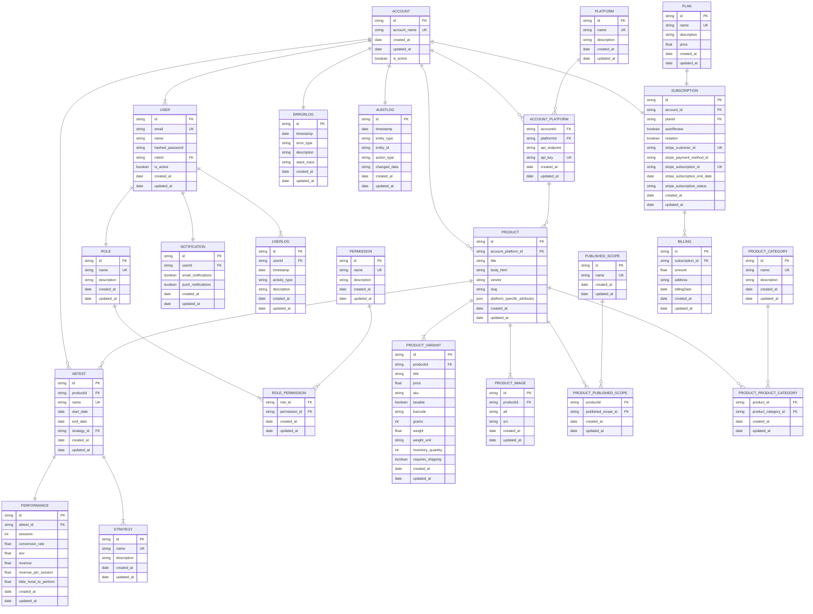

```mermaid
erDiagram
  ACCOUNT ||--|{ USER : ""
    ACCOUNT ||--|| SUBSCRIPTION : ""
    ACCOUNT ||--o{ PRODUCT : ""
    ACCOUNT ||--o{ ABTEST : ""
    ACCOUNT ||--|| ERRORLOG : ""
    ACCOUNT ||--|| AUDITLOG : ""
    ACCOUNT ||--o{ ACCOUNT_PLATFORM : ""

    USER ||--|| ROLE : ""
    USER ||--|| NOTIFICATION : ""
    USER ||--|{ USERLOG : ""
    
    ROLE ||--|{ ROLE_PERMISSION : ""
    PERMISSION ||--|{ ROLE_PERMISSION : ""
    PLAN ||--|| SUBSCRIPTION : ""

    PRODUCT ||--o{ ABTEST : ""
    PRODUCT ||--|{ PRODUCT_VARIANT : ""
    PRODUCT ||--|{ PRODUCT_IMAGE : ""
    PRODUCT ||--o{ PRODUCT_PUBLISHED_SCOPE : ""
    PRODUCT ||--o{ PRODUCT_PRODUCT_CATEGORY : ""

    PLATFORM ||--o{ ACCOUNT_PLATFORM : ""
    ACCOUNT_PLATFORM ||--o{ PRODUCT : ""

    PUBLISHED_SCOPE ||--o{ PRODUCT_PUBLISHED_SCOPE : ""
    PRODUCT_CATEGORY ||--o{ PRODUCT_PRODUCT_CATEGORY : ""

    ABTEST ||--|| PERFORMANCE : ""
    ABTEST ||--|{ STRATEGY : ""

    SUBSCRIPTION ||--o{ BILLING : ""

    ACCOUNT {
        string id PK
        string account_name UK
        date created_at
        date updated_at
        boolean is_active
    }


    USER {
        string id PK
        string email UK
        string name
        string hashed_password
        string roleId FK
        boolean is_active
        date created_at
        date updated_at
    }

    ROLE {
        string id PK
        string name UK
        string description
        date created_at
        date updated_at
    }

    PERMISSION {
        string id PK
        string name UK
        string description
        date created_at
        date updated_at
    }

    ROLE_PERMISSION {
        string role_id FK
        string permission_id FK
        date created_at
        date updated_at
    }

    PLAN {
        string id PK
        string name UK
        string description
        float price
        date created_at
        date updated_at
    }

    SUBSCRIPTION {
        string id PK
        string account_id FK
        string planId FK
        boolean autoRenew
        boolean notation
        string stripe_customer_id UK
        string stripe_payment_method_id
        string stripe_subscription_id UK
        date stripe_subscription_end_date
        string stripe_subscription_status
        date created_at
        date updated_at
    }

    BILLING {
        string id PK
        string subscription_id FK
        float amount
        string address
        date billingDate
        date created_at
        date updated_at
    }


    PLATFORM {
        string id PK
        string name UK
        string description
        date created_at
        date updated_at
    }

    ACCOUNT_PLATFORM {
        string accountId FK
        string platformId FK
        string api_endpoint
        string api_key UK
        date created_at
        date updated_at
    }

    PRODUCT {
        string id PK
        string account_platform_id FK
        string title
        string body_html
        string vendor
        string slug
        json platform_specific_attributes
        date created_at
        date updated_at
    }

    PUBLISHED_SCOPE {
        string id PK
        string name UK
        date created_at
        date updated_at 
    }

    PRODUCT_PUBLISHED_SCOPE {
        string productId FK
        string published_scope_id FK
        date created_at
        date updated_at
    }

    PRODUCT_CATEGORY {
        string id PK
        string name UK
        string description
        date created_at
        date updated_at
    }

    PRODUCT_PRODUCT_CATEGORY {
        string product_id FK
        string product_category_id FK
        date created_at
        date updated_at
    }

    PRODUCT_VARIANT {
        string id PK
        string productId FK
        string title
        float price
        string sku
        boolean taxable
        string barcode
        int grams
        float weight
        string weight_unit
        int inventory_quantity
        boolean requires_shipping
        date created_at
        date updated_at
    }

    PRODUCT_IMAGE {
        string id PK
        string productId FK
        string alt
        string src
        date created_at
        date updated_at
    }

    ABTEST {
        string id PK
        string productId FK
        string name UK
        date start_date
        date end_date
        string strategy_id FK
        date created_at
        date updated_at
    }

    PERFORMANCE {
        string id PK
        string abtest_id FK
        int sessions
        float conversion_rate
        float aov
        float revenue
        float revenue_per_session
        float liklie_hood_to_perform
        date created_at
        date updated_at
    }

    STRATEGY {
        string id PK
        string name UK
        string description
        date created_at
        date updated_at
    }

    NOTIFICATION {
        string id PK
        string userId FK
        boolean email_notifications
        boolean push_notifications
        date created_at
        date updated_at
    }

    USERLOG {
        string id PK
        string userId FK
        date timestamp
        string activity_type
        string description
        date created_at
        date updated_at
    }

    ERRORLOG {
        string id PK
        date timestamp
        string error_type
        string description
        string stack_trace
        date created_at
        date updated_at
    }

    AUDITLOG {
        string id PK
        date timestamp
        string entity_type
        string entity_id
        string action_type
        string changed_data
        date created_at
        date updated_at
    }
```
