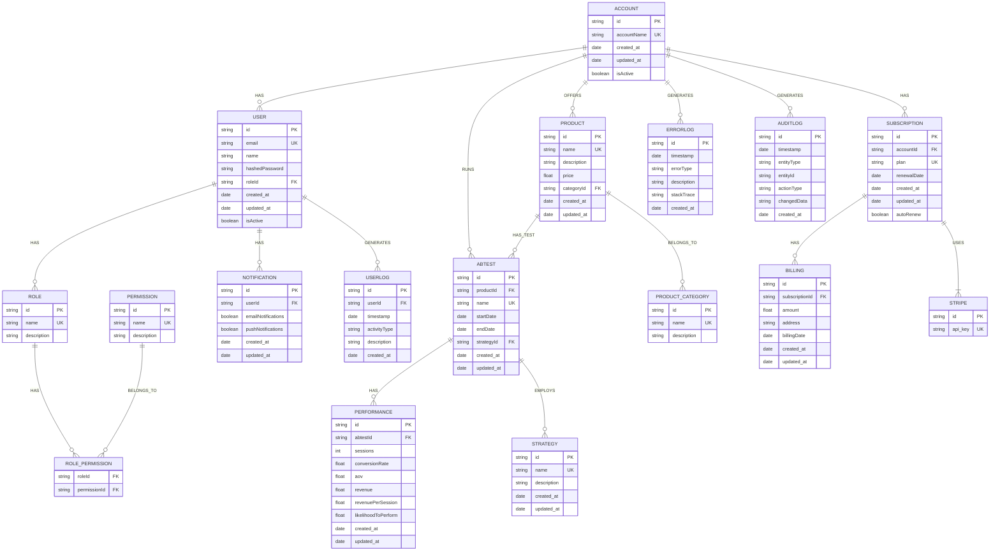

```mermaid
erDiagram
    ACCOUNT ||--o{ USER : "HAS"
    ACCOUNT ||--o{ SUBSCRIPTION : "HAS"
    ACCOUNT ||--o{ PRODUCT : "OFFERS"
    ACCOUNT ||--o{ ABTEST : "RUNS"
    ACCOUNT ||--o{ ERRORLOG : "GENERATES"
    ACCOUNT ||--o{ AUDITLOG : "GENERATES"
    USER ||--o{ ROLE : "HAS"
    USER ||--o{ NOTIFICATION : "HAS"
    USER ||--o{ USERLOG : "GENERATES"
    ROLE ||--o{ ROLE_PERMISSION : "HAS"
    PERMISSION ||--o{ ROLE_PERMISSION : "BELONGS_TO"
    PRODUCT ||--o{ ABTEST : "HAS_TEST"
    PRODUCT ||--o{ PRODUCT_CATEGORY : "BELONGS_TO"
    ABTEST ||--o{ PERFORMANCE : "HAS"
    ABTEST ||--o{ STRATEGY : "EMPLOYS"
    SUBSCRIPTION ||--o{ BILLING : "HAS"
    SUBSCRIPTION ||--|{ STRIPE : "USES"

    ACCOUNT {
        string id PK
        string accountName UK
        date created_at
        date updated_at
        boolean isActive
    }

    USER {
        string id PK
        string email UK
        string name
        string hashedPassword
        string roleId FK
        date created_at
        date updated_at
        boolean isActive
    }

    ROLE {
        string id PK
        string name UK
        string description
    }

    PERMISSION {
        string id PK
        string name UK
        string description
    }

    ROLE_PERMISSION {
        string roleId FK
        string permissionId FK
    }
 
    SUBSCRIPTION {
        string id PK
        string accountId FK
        string plan UK
        date renewalDate
        date created_at
        date updated_at
        boolean autoRenew
    }

    STRIPE {
        string id PK
        string api_key UK
    }

    BILLING {
        string id PK
        string subscriptionId FK
        float amount
        string address
        date billingDate
        date created_at
        date updated_at
    }

    PRODUCT {
        string id PK
        string name UK
        string description
        float price
        string categoryId FK
        date created_at
        date updated_at
    }

    PRODUCT_CATEGORY {
        string id PK
        string name UK
        string description
    }

    ABTEST {
        string id PK
        string productId FK
        string name UK
        date startDate
        date endDate
        string strategyId FK
        date created_at
        date updated_at
    }

    PERFORMANCE {
        string id PK
        string abtestId FK
        int sessions
        float conversionRate
        float aov
        float revenue
        float revenuePerSession
        float likelihoodToPerform
        date created_at
        date updated_at
    }

    STRATEGY {
        string id PK
        string name UK
        string description
        date created_at
        date updated_at
    }

    NOTIFICATION {
        string id PK
        string userId FK
        boolean emailNotifications
        boolean pushNotifications
        date created_at
        date updated_at
    }

    USERLOG {
        string id PK
        string userId FK
        date timestamp
        string activityType
        string description
        date created_at
    }

    ERRORLOG {
        string id PK
        date timestamp
        string errorType
        string description
        string stackTrace
        date created_at
    }

    AUDITLOG {
        string id PK
        date timestamp
        string entityType
        string entityId
        string actionType
        string changedData
        date created_at
    }
```
